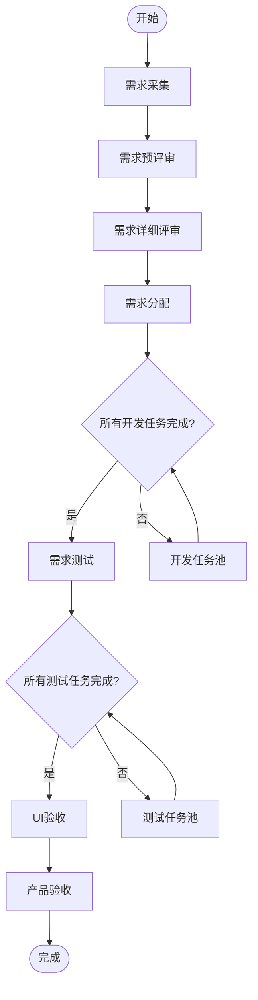

# 需求交付流转规则

## 1. 主流程

## 2. 开发任务池

```mermaid
flowchart LR
  subgraph backend[服务端]
    beSchedule[待排期] --> beTodo[待开发] --> beDoing[开发中] --> beJoint[联调中] --> beDone[开发完成]
  end

  subgraph ios[iOS]
    iosSchedule[待排期] --> iosTodo[待开发] --> iosDoing[开发中] --> iosJoint[联调中] --> iosDone[开发完成]
  end

  subgraph android[安卓]
    androidSchedule[待排期] --> androidTodo[待开发] --> androidDoing[开发中] --> androidJoint[联调中] --> androidDone[开发完成]
  end

  subgraph miniProgram[小程序]
    mpSchedule[待排期] --> mpTodo[待开发] --> mpDoing[开发中] --> mpJoint[联调中] --> mpDone[开发完成]
  end

  subgraph harmony[鸿蒙]
    hmSchedule[待排期] --> hmTodo[待开发] --> hmDoing[开发中] --> hmJoint[联调中] --> hmDone[开发完成]
  end

  subgraph web[Web]
    webSchedule[待排期] --> webTodo[待开发] --> webDoing[开发中] --> webJoint[联调中] --> webDone[开发完成]
  end
```

## 3. 流程节点

| 阶段 | 控制方式 | 角色/任务 | 可进入下一阶段条件 |
| --- | --- | --- | --- |
| 需求采集 | 单节点流转 | 产品/业务 | 状态流转权限 |
| 需求预评审 | 单节点流转 | 产品、研发、测试 | 状态流转权限 |
| 需求详细评审 | 单节点流转 | 产品、研发、测试 | 状态流转权限 |
| 需求分配 | 单节点流转 | 产品/项目负责人 | 状态流转权限 |
| 需求开发 | 多任务并行 | 服务端、iOS、安卓、小程序、鸿蒙、Web | 至少一个开发任务，且全部开发完成 |
| 需求测试 | 多任务并行 | 测试任务 | 至少一个测试任务，且全部测试完成 |
| UI验收 | 单节点流转 | UI/设计 | 状态流转权限 |
| 产品验收 | 单节点流转 | 产品 | 状态流转权限 |
| 完成 | 终态 | - | - |

## 4. 门禁规则

### 4.1 开发门禁

- 仅当需求主状态为“需求开发”时启用。
- 开发任务数量为 0 时，禁止进入“需求测试”。
- 只统计任务类型为 `DEV` 且未删除的任务。
- 所有开发任务状态必须为 `DEV_DONE`。
- 若存在开发任务负责人为空，仍允许完成门禁，但页面应提示任务责任不完整。

### 4.2 测试门禁

- 仅当需求主状态为“需求测试”时启用。
- 测试任务数量为 0 时，禁止进入“UI验收”。
- 只统计任务类型为 `TEST` 且未删除的任务。
- 所有测试任务状态必须为 `TEST_DONE`。

### 4.3 验收提示

- UI验收和产品验收第一阶段不拆验收任务。
- 如果需求下存在未关闭 Bug，产品验收进入完成时提示风险。
- 未关闭 Bug 不强制阻断完成。

## 5. 回退规则

- 支持回退到上一主状态。
- 完成状态不支持继续正向流转。
- 完成状态回退需要管理员或状态流转权限。
- 回退不删除任务池、不重置任务状态。
- 每次回退写入状态历史，记录操作人、旧状态、新状态和原因。

## 6. 历史记录

需要记录：

- 创建需求。
- 编辑需求基础信息。
- 主状态正向流转。
- 主状态回退。
- 新增任务。
- 编辑任务。
- 删除任务。
- 任务状态变更。

历史字段：

- 需求 ID。
- 操作类型。
- 操作字段。
- 旧值。
- 新值。
- 操作人。
- 操作时间。
- 备注。
