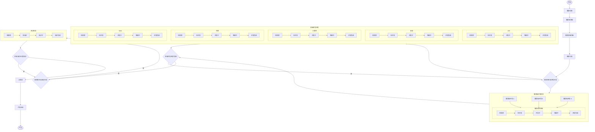

# 需求交付流程图

## 流程节点

| 阶段 | 控制方式 | 角色/任务 | 状态 |
| --- | --- | --- | --- |
| 需求采集 | 单节点流转 | 产品/业务 | - |
| 需求预评审 | 单节点流转 | 产品、研发、测试等评审角色 | - |
| 需求详细评审 | 单节点流转 | 产品、研发、测试等评审角色 | - |
| 需求分配 | 按角色拆分任务 | 服务端、iOS、安卓、小程序、鸿蒙、Web、测试等 | - |
| 需求开发 | 多任务并行，全部完成后汇聚 | 多个服务端开发、多个前端开发 | 待排期、待开发、开发中、联调中、开发完成 |
| 需求测试 | 多任务并行，全部完成后汇聚 | 测试角色，可按模块或测试人拆分 | 待排期、待测试、测试中、测试完成 |
| UI验收 | 单节点或多角色验收汇聚 | UI/设计 | - |
| 产品验收 | 单节点或多角色验收汇聚 | 产品 | - |
| 产品 | 终态 | - | - |

## 流转规则

1. 需求分配后，系统按参与角色生成独立任务。
2. 同一角色可以存在多个任务，例如多个服务端开发并行处理不同模块。
3. 不同角色任务并行推进，例如服务端、iOS、安卓、小程序、鸿蒙、Web 可以同步开发。
4. 需求主状态进入测试前，必须满足所有开发任务均为“开发完成”。
5. 测试、UI验收、产品验收也可以按角色或人员拆分任务，并通过“全部完成”规则控制主流程流转。
